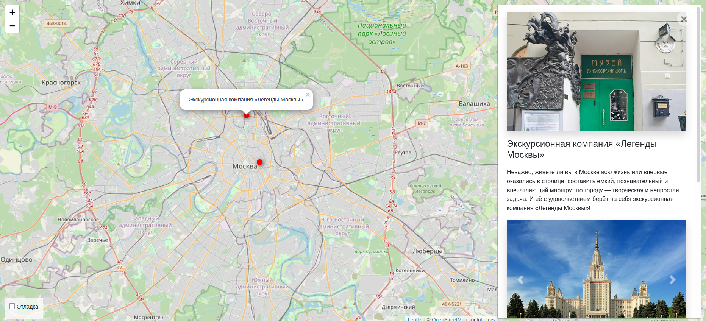

# Куда пойти -- Москва глазами Артёма



### Предметная область

Сайт для удобного нахождения потенциально интересных мест в Москве с помощью интерактивной карты Яндекса. На карте отмечены точки, при клике на каждую из которых появляется информация о соответствующем месте, включая фотографии. Места можно добавлять через админку Django, указывая там названия места, информацию о нём, координаты, а также загружая туда фотографии. Каждая фотография ассоциирована с тем или иным местом на карте, и эти фотографии в админке можно легко менять местами, что соответственно меняет местоположение фотографий в информационном блоке соответствующего места.


Помимо этого админка оснащена удобным текстовым редактором [TinyMCE](https://github.com/aljosa/django-tinymce).


### Как запустить

Для запуска сайта вам понадобится Python 3.x.

Скачайте код с GitHub. Затем установите зависимости

```sh
pip install -r requirements.txt
```

Запустите разработческий сервер

```sh
python3 manage.py runserver
```

### Переменные окружения

Часть настроек проекта берётся из переменных окружения. Чтобы их определить, создайте файл `.env` рядом с `manage.py` и запишите туда данные в таком формате: `ПЕРЕМЕННАЯ="значение"`.

Доступны 2 переменные:
- `DATABASE_ENGINE` — движок для вашей базы данных, например `"django.db.backends.sqlite3"`.
- `SECRET_KEY` — секретный ключ Django-проекта.
- `DATABASE_NAME` — имя вашей базы данных, например `"db.sqlite3"`.
- `ALLOWED_HOST_N`, где N является целым числом — адреса серверов, с которых проект будет запускаться. Например: `ALLOWED_HOST_1 = "localhost"`. Если вам нужно более одного адреса, то вам нужно будет соответствующим образом отредактировать файл `settings.py` данного проекта.

## Цели проекта

Код написан в учебных целях — это урок в курсе по Python и веб-разработке на сайте [Devman](https://dvmn.org).
